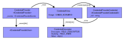
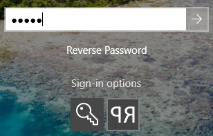

Example Windows Credential Provider that require your password to by typed backwards. Written in C#.

## Design
Overall class diagram:  

| Class | Description |
|-------|-------------|
| `CredentialProvider` <[ICredentialProvider](https://learn.microsoft.com/en-us/windows/win32/api/credentialprovider/nn-credentialprovider-icredentialprovider), [ICredentialProviderSetUserArray](https://learn.microsoft.com/en-us/windows/win32/api/credentialprovider/nn-credentialprovider-icredentialprovidersetuserarray)> | Parent class that's created by Windows. The `_providerUsers` member is similarly initialized on `SetUserArray` calls. |
| `CredentialView` | Instances are created when `CredentialProvider` initializes its `_view` member when receiving `SetUsageScenario` calls. |
| `CredentialProviderCredential` <[ICredentialProviderCredential2](https://learn.microsoft.com/en-us/windows/win32/api/credentialprovider/nn-credentialprovider-icredentialprovidercredential2)>| Instances are created on-demand by `CredentialView` when `CredentialProvider` receives `GetCredentialAt` calls. |

## How to test
It's recommended to **test in a disposable Virtual Machine (VM)**, since credential provider problems might break the windows logon screen. You don't want to risk that on your main computer.

#### Build steps
* Open solution in Visual Studio and build in release or debug mode.

#### Installation steps
* Install [.NET 8 Desktop Runtime](https://dotnet.microsoft.com/en-us/download/dotnet)
* Right click on `REGISTER.bat` and select "Run as administrator".
* Log screen, log out or restart the computer.
* Observe that there's now a new "RP" sign-in option:  
  

* `CredUITester.exe` can also be used for testing the credential provider:  
  

#### Uninstallation steps
* Right click on `UNREGISTER.bat` and select "Run as administrator".

## Authentication and logon APIs

#### User session and authentication
* Show authentication dialog: [CredUIPromptForWindowsCredentials](https://learn.microsoft.com/en-us/windows/win32/api/wincred/nf-wincred-creduipromptforwindowscredentialsw)
* Logoff, shutdown or restart:  [ExitWindowsEx](https://learn.microsoft.com/en-us/windows/win32/api/winuser/nf-winuser-exitwindowsex) with `EWX_LOGOFF`, `EWX_POWEROFF` or `EWX_REBOOT` parameter.
* Lock desktop: [LockWorkStation](https://learn.microsoft.com/en-us/windows/win32/api/winuser/nf-winuser-lockworkstation) (same as Ctrl+Alt+Del and click "Lock")
* Authenticate to impersonate a user: [LogonUserW](https://learn.microsoft.com/en-us/windows/win32/api/winbase/nf-winbase-logonuserw)

#### Credential provider
* [Credential providers in Windows](https://learn.microsoft.com/en-us/windows/win32/secauthn/credential-providers-in-windows)
* [Credential Provider driven Windows Logon Experience](https://github.com/user-attachments/files/22509252/Credential_Provider_Technical_Reference.pdf) (converted https://go.microsoft.com/fwlink/?LinkId=717287 from XPS to PDF)

The project is heavily based on the no longer maintained [CredProvider.NET](https://github.com/SteveSyfuhs/CredProvider.NET)
